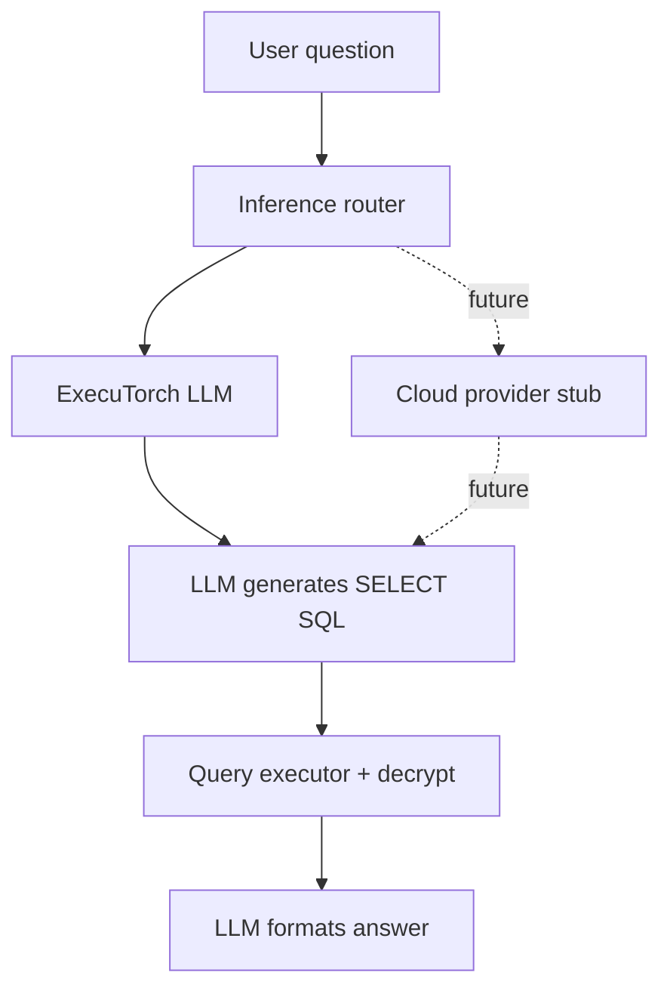

# AI Feature Documentation

## Overview

The AI feature lets users ask natural language questions about their financial data and get answers from local SQLite data. It uses a **privacy-first architecture** with on-device inference via ExecuTorch, plus a pluggable cloud provider for future premium models.

## Architecture



### Intelligence layers

All AI features require a loaded on-device model (or future cloud model). There is no rule-based fallback.

1. **Ask Budgetize** — LLM generates a safe SELECT query → query executor runs it and decrypts results → LLM writes the natural-language answer.
2. **Categorization** — LLM picks category from note text (no keyword rules).
3. **Dashboard insights** — Metrics from existing hooks are passed to the LLM, which generates insight cards as JSON.

## On-Device AI Stack

| Component | Technology |
|-----------|------------|
| Inference | `react-native-executorch` (Meta ExecuTorch) |
| Models | Hugging Face `.pte` models (Llama 3.2, Qwen3, SmolLM2, Phi-4, etc.) |
| Download | Wi-Fi only by default; optional cellular in Settings |
| Storage | App document directory via Expo resource fetcher |

### User-selectable models

Users choose an on-device model in **Settings → AI Assistant → On-Device Model**:

| Model | Tier | Approx. size |
|-------|------|--------------|
| Llama 3.2 1B (Fast) | Default | ~500 MB |
| Llama 3.2 1B (Full) | Balanced | ~1.2 GB |
| Llama 3.2 3B (Fast) | Quality | ~1.5 GB |
| Qwen3 0.6B | Fast | ~400 MB |
| SmolLM2 135M | Ultra-fast | ~150 MB |
| Phi-4 Mini 4B | Quality | ~2.5 GB |

### Cloud models (future)

Settings includes **AI Processing → Cloud (Coming Soon)**. The `cloudAiProvider` stub implements the same `AiInferenceProvider` interface so cloud APIs can be wired in without changing feature code.

## Setup requirements

- **Dev client / EAS build required** — does not work in Expo Go
- **iOS 17+**, **Android 13+**, New Architecture enabled
- Model downloaded once via in-app prompt on the Ask tab

## Settings

In **Settings → AI Assistant**:

- **On-Device AI** — Enable/disable AI features
- **AI Processing** — On-device (default) or Cloud (coming soon)
- **On-Device Model** — Choose Hugging Face model variant
- **Allow Cellular Download** — Download model over mobile data

## Files

```
services/ai/
  model-catalog.ts          # User-selectable Hugging Face models
  executorch-init.ts        # ExecuTorch runtime initialization
  providers/
    types.ts                # AiInferenceProvider interface
    on-device-provider.ts   # ExecuTorch LLMModule wrapper
    cloud-provider.ts       # Cloud stub for future integration
    inference-router.ts     # Routes by settings.aiExecutionMode
  ai-service.ts             # SQL/answer/categorize/insights via router
  model-manager.ts          # Download/delete model resources
  ai-assistant-service.ts   # Ask Budgetize orchestration
  categorization.ts
  prompts.ts
```

## Privacy

- On-device mode: 100% local processing after model download
- No financial data sent to network endpoints in on-device mode
- Encrypted SQLite fields decrypted locally only
